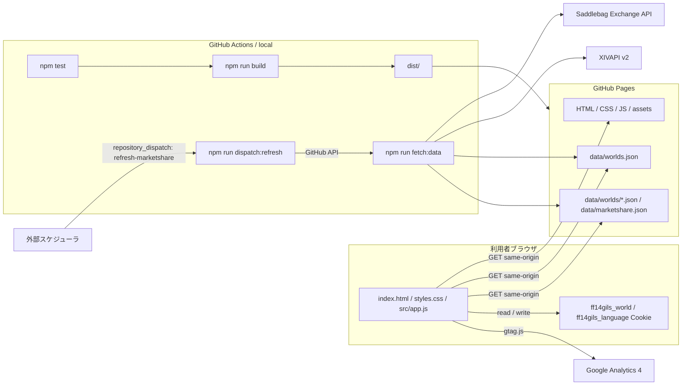

# FF14Gils

FF14 のマーケットデータから、金策候補とワールド別の売上ランキングを確認する GitHub Pages 向け静的サイトです。

## 概要

- 公開URL: `https://jinwktk.github.io/FF14Gils/`
- 初期表示ワールド: `Hades`
- 対応期間: 1日、3日、7日
- 対象ワールド: 公式 Lodestone のワールド構成に合わせた全DC 85ワールド
- 画面: 金策候補 `/`、ワールド売上ランキング `/ranking`、権利表記とデータ `/legal`
- UI言語: 日本語 / English。選択言語とワールドは Cookie に保存します。

利用者ブラウザは GitHub Pages から配信される静的ファイルと生成済み JSON だけを読みます。ブラウザから Saddlebag Exchange API や XIVAPI v2 へ直接 POST / GET しません。

## 主な機能

- DC とワールドを分けて選択できます。DC は北米、欧州、日本、オセアニアの見出し付きで表示します。
- 期間、検索、状態、最低販売数、列ソートで候補を絞り込めます。
- ランキング画面では、生成済みスナップショットの `summary` から期間別の全ワールド売上合計を表示します。
- 最終更新日時は利用者ブラウザのタイムゾーンで表示します。
- `/ranking/` と `/legal/` は GitHub Pages で直接開けるよう、build 時に静的入口を生成します。

## データと権利

FF14Gils は FINAL FANTASY XIV の非公式ファンサイトです。SQUARE ENIX CO., LTD. とは関係ありません。FINAL FANTASY XIV に関する名称、データ、画像、その他の権利は SQUARE ENIX CO., LTD. に帰属します。

データ生成では以下を利用します。

- Saddlebag Exchange API: マーケット集計候補の取得
- XIVAPI v2: アイテム名の補完
- Google Analytics 4: ページ閲覧状況の把握

データ元には外部ツールで入手したデータが含まれる場合があります。FF14Gils はその取得方法を管理または保証しません。ゲームクライアント、アカウント、プレイ操作へ接続せず、RMT、BOT、外部ツールによる自動操作を目的としません。

公開ページ上の詳しい説明は `/legal` に置いています。権利・利用条件面の懸念を避けるため、外部支援リンクは表示しません。

## アーキテクチャ



`npm run fetch:data` が外部 API からスナップショットを生成し、`npm run build` が `dist/` に静的配信物を作ります。push / 手動デプロイでは API を呼ばず、公開中の `data/` を `dist/` に復元してから Pages へ反映します。

## 開発コマンド

```powershell
npm test
npm run fetch:data
npm run dispatch:refresh
npm run restore:published-data
npm run build
npm run serve
```

favicon を再生成する場合:

```powershell
npm run favicon:generate
```

## 環境変数

`npm run fetch:data` の主な設定です。

- `FF14GILS_SERVER`: 既定ワールド
- `FF14GILS_WORLDS`: 生成対象ワールドのカンマ区切り。未指定時は全85ワールド
- `FF14GILS_PERIODS`: `1d`、`3d`、`7d`
- `FF14GILS_PRESET`: `all`、`housing`、`materials`、`consumables`、`collectibles`、`custom`
- `FF14GILS_CUSTOM_FILTERS`: `custom` 用カテゴリ ID
- `FF14GILS_FETCH_RETRIES`: 外部 API の一時的な `429` / `5xx` 応答を再試行する回数
- `FF14GILS_FETCH_RETRY_DELAY_MS`: 外部 API リトライの初回待機時間
- `FF14GILS_ITEM_NAME_LANGUAGE`: XIVAPI v2 から取得するアイテム名の言語。`ja`、`en`、`fr`、`de`

`npm run dispatch:refresh` は外部スケジューラから GitHub Actions の `repository_dispatch: refresh-marketshare` を送るためのコマンドです。

- `FF14GILS_GITHUB_TOKEN` または `GITHUB_TOKEN`: GitHub API へ `repository_dispatch` を送るトークン。repo には保存しません。
- `FF14GILS_GITHUB_REPOSITORY`: 送信先。未指定時は `jinwktk/FF14Gils`
- `FF14GILS_DISPATCH_EVENT_TYPE`: イベント名。未指定時は `refresh-marketshare`
- `FF14GILS_DISPATCH_SOURCE`: `client_payload.source`。未指定時は `external-hourly-scheduler`

## デプロイ

`.github/workflows/pages.yml` が GitHub Pages デプロイを担当します。

- trigger: `schedule`、`repository_dispatch: refresh-marketshare`、`push`、`workflow_dispatch`
- 毎回実行: `npm ci`、`npm test`、`npm run build`
- データ更新あり: `schedule` と `repository_dispatch`
- データ更新なし: `push` と `workflow_dispatch`。`npm run restore:published-data` で公開中データを復元

毎時データ更新の主経路は、外部スケジューラから `npm run dispatch:refresh` を実行して `repository_dispatch: refresh-marketshare` を送る運用です。GitHub Actions の schedule は補助として毎時17分に残しますが、GitHub 側の遅延または間引きがあるため、厳密な毎時起動の主経路にはしません。
