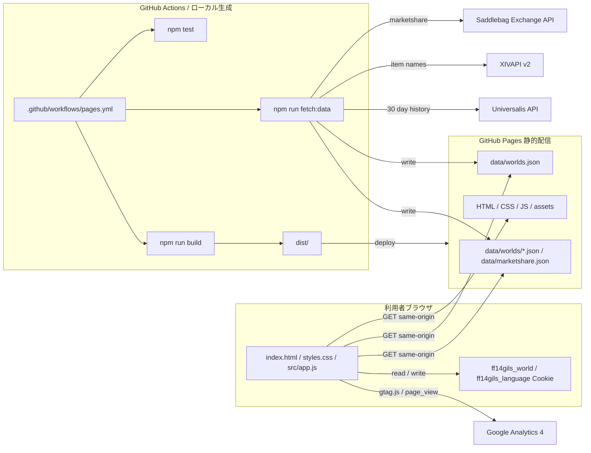

# FF14Gils

FF14 のマーケットデータから、金策候補を探すための GitHub Pages 向け静的サイトです。

## 概要

- 利用者ブラウザは GitHub Pages 上の静的ファイルと生成済み JSON だけを読み込みます。
- マーケットデータの取得と JSON 生成は GitHub Actions またはローカルの `npm run fetch:data` で行います。
- 初期表示は `Hades`、売上期間は 1日、3日、7日、1か月に対応しています。
- 公式 Lodestone のワールド構成に合わせ、Aether、Crystal、Dynamis、Primal、Chaos、Light、Materia、Elemental、Gaia、Mana、Meteor の全DC 85ワールドを対象にします。
- DC選択でワールド候補を絞り込み、ワールド選択、期間選択、検索、状態フィルタ、最低販売数フィルタ、列ソートに対応しています。
- UI 表示言語は日本語と英語を切り替えできます。選択した言語は Cookie に保存されます。

## データと権利について

FF14Gils は FINAL FANTASY XIV の非公式ファンサイトです。SQUARE ENIX CO., LTD. とは関係ありません。
FINAL FANTASY XIV に関する名称、データ、画像、その他の権利は SQUARE ENIX CO., LTD. に帰属します。

データ生成では以下の公開データ元を利用します。

- Saddlebag Exchange API: 1日、3日、7日のマーケット集計候補を取得します。
- Universalis API: 1か月表示の販売履歴再集計に利用します。
- XIVAPI v2: アイテム名の取得だけに利用します。説明文、アイコン、詳細なゲームデータは保存しません。

外部データ元の仕様や利用条件は変更される可能性があります。運用時は各サービスの公開ドキュメントと利用条件を確認し、必要に応じて取得方法や表示内容を見直します。

## アーキテクチャ



ブラウザから外部 API へ直接 POST せず、GitHub Pages で配信される同一オリジンの JSON を表示します。
ワールド選択は全DC 85ワールドを1つの長いプルダウンにせず、先にDCを選んでから該当DCのワールドだけを表示します。
アクセス計測は Google Analytics 4 の Measurement ID `G-VH5GMQMZ34` を `gtag.js` で読み込みます。

## 開発コマンド

```powershell
npm test
npm run fetch:data
npm run build
npm run serve
```

favicon を再生成する場合:

```powershell
npm run favicon:generate
```

## 環境変数

`npm run fetch:data` は主に以下の環境変数で取得条件を変更できます。

- `FF14GILS_SERVER`: 初期表示するワールド名。
- `FF14GILS_WORLDS`: 生成するワールド名のカンマ区切り。未指定時は全DC 85ワールド。
- `FF14GILS_PERIODS`: 生成する売上期間。`1d`、`3d`、`7d`、`30d`。
- `FF14GILS_PRESET`: `all`、`housing`、`materials`、`consumables`、`collectibles`、`custom`。
- `FF14GILS_CUSTOM_FILTERS`: `custom` 用のカテゴリ ID。
- `FF14GILS_FETCH_RETRIES`: 外部APIの一時的な `429` / `5xx` 応答を再試行する回数。
- `FF14GILS_FETCH_RETRY_DELAY_MS`: 外部APIリトライの初回待機時間。
- `FF14GILS_ITEM_NAME_LANGUAGE`: XIVAPI v2 から取得するアイテム名の言語。`ja`、`en`、`fr`、`de`。

データ生成時の Saddlebag Exchange API と Universalis API への通信は、一時的な `429` / `5xx` 応答を短くリトライします。
既定では `ja` のアイテム名を `data/item-names-ja.json` にキャッシュします。英語UIでは Saddlebag 由来の英語名を優先表示し、日本語UIでは XIVAPI 由来の日本語名を優先表示します。
全DC生成時は 85ワールド x 4期間の最大340スナップショットを生成します。

## デプロイ

`.github/workflows/pages.yml` が `npm test`、`npm run fetch:data`、`npm run build` を実行し、生成された `dist/` を GitHub Pages へデプロイします。
