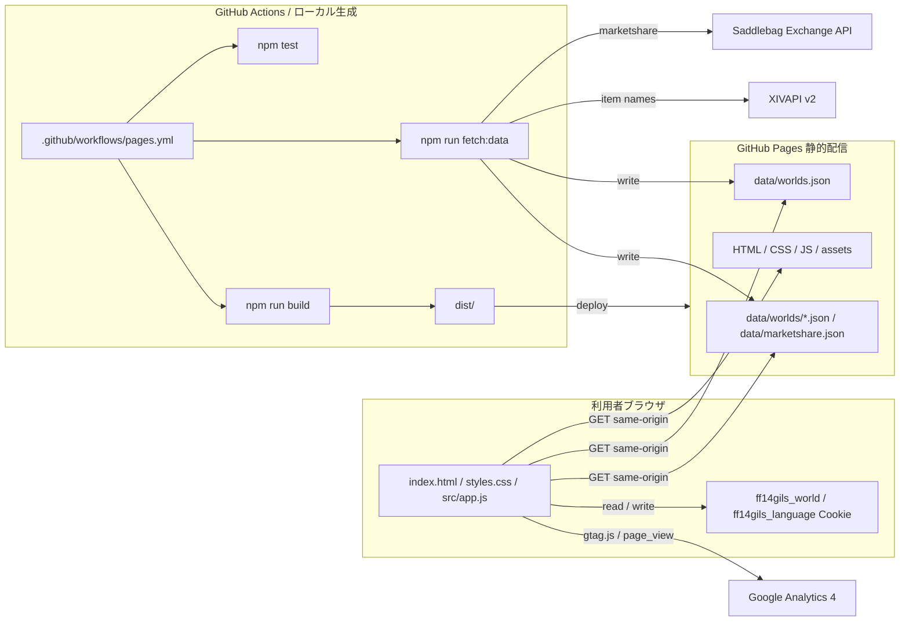

# FF14Gils

FF14 のマーケットデータから、金策候補を探すための GitHub Pages 向け静的サイトです。

## 概要

- 利用者ブラウザは GitHub Pages 上の静的ファイルと生成済み JSON だけを読み込みます。
- マーケットデータの取得と JSON 生成は GitHub Actions またはローカルの `npm run fetch:data` で行います。
- 初期表示は `Chocobo`、売上期間は 1日、3日、7日に対応しています。
- 公式 Lodestone のワールド構成に合わせ、Aether、Crystal、Dynamis、Primal、Chaos、Light、Materia、Elemental、Gaia、Mana、Meteor の全DC 85ワールドを対象にします。
- DC選択は北米、欧州、日本、オセアニアの見出し付きで選べます。選んだDCでワールド候補を絞り込み、期間選択、検索、状態フィルタ、最低販売数フィルタ、列ソートに対応しています。
- 画面はSPAとして `/`、`/ranking`、`/legal` を切り替えます。上部ナビから金策候補、ワールド売上ランキング、権利表記とデータへ移動できます。
- ワールド売上ランキング画面では、選択中の売上期間に対して全ワールドの売上合計ランキングを表示します。リージョン、DC、ワールドを並べ、ランキング行のワールド名から対象ワールドへ切り替えできます。ランキングもデータ生成時に再構築され、`data/worlds.json` の生成時刻を最終更新として表示します。
- UI 表示言語は日本語と英語を切り替えできます。選択した言語は Cookie に保存されます。
- 権利表記とデータ画面は `article` とセクション見出しで文書構造を明確にし、本文は中央寄せの読み物幅、読みやすい文字サイズ、行間、行長に調整しています。データ元リストの区切り線と注意書きも本文幅に揃えています。
- 最終更新日時は、利用者ブラウザのタイムゾーンに合わせて表示します。
- 権利・利用条件面の懸念を避けるため、支援リンクなどの外部支援導線は表示しません。

## データと権利について

FF14Gils は FINAL FANTASY XIV の非公式ファンサイトです。SQUARE ENIX CO., LTD. とは関係ありません。
FINAL FANTASY XIV に関する名称、データ、画像、その他の権利は SQUARE ENIX CO., LTD. に帰属します。

データ生成では以下の公開データ元を利用します。

- Saddlebag Exchange API: 1日、3日、7日のマーケット集計候補を取得します。
- XIVAPI v2: アイテム名の取得だけに利用します。説明文、アイコン、詳細なゲームデータは保存しません。

データ元には、外部ツールで入手したデータが含まれる場合があります。FF14Gils は、その取得方法を管理または保証しません。

アクセス計測では Google Analytics 4 を利用します。計測はページ閲覧状況の把握に限り、FF14Gils から Google Analytics へ個人を特定できる情報は送信しません。

外部データ元の仕様や利用条件は変更される可能性があります。運用時は各サービスの公開ドキュメントと利用条件を確認し、必要に応じて取得方法や表示内容を見直します。
2026-06-30 時点の確認では、Saddlebag Exchange の ffxivmarketshare は内部的に Universalis へ問い合わせるため、全DC生成は順次取得、短いリトライ、生成済み JSON の静的配信を前提にして過剰な取得を避けます。
集計期間は 1日、3日、7日であり、10分単位の更新価値は小さいため、GitHub Actions の定期更新は1時間おきにします。
FF14Gils はゲームクライアント、アカウント、プレイ操作へ接続せず、RMT、BOT、外部ツールによる自動操作を目的としません。
公開ページの詳細は `/legal` に表示します。互換用の `legal.html` は旧URLからSPAへ戻すためだけに使います。

## アーキテクチャ



ブラウザから外部 API へ直接 POST せず、GitHub Pages で配信される同一オリジンの JSON を表示します。
ワールド選択は全DC 85ワールドを1つの長いプルダウンにせず、北米、欧州、日本、オセアニアの見出し付きDC選択から絞り込んで、該当DCのワールドだけを表示します。
SPAの画面切り替えは History API を使います。GitHub Pages の配信成果物では `npm run build` が `dist/ranking/index.html` と `dist/legal/index.html` を生成し、sitemap の `/ranking/` と `/legal/` が 200 で返る入口を用意します。その他のクリーンURLは `404.html` フォールバックから、旧 `/legal.html` へ直接アクセスされた場合は互換用 `legal.html` からアプリへ戻して表示を復元します。
ワールド売上ランキングは追加APIを呼ばず、生成済みスナップショットの `summary` から `data/worlds.json` に期間別ランキングを保持し、リージョンとDCを併記して表示します。ランキング画面の最終更新は `data/worlds.json` の `generatedAt` を利用します。
アクセス計測は Google Analytics 4 の Measurement ID `G-VH5GMQMZ34` を `gtag.js` で読み込みます。
外部支援リンクは表示せず、JSON-LD の `sameAs` にも支援先 URL を載せません。

## 開発コマンド

```powershell
npm test
npm run fetch:data
npm run restore:published-data
npm run build
npm run serve
```

favicon を再生成する場合:

```powershell
npm run favicon:generate
```

## 環境変数

`npm run fetch:data` は主に以下の環境変数で取得条件を変更できます。

- `FF14GILS_SERVER`: 初期表示するワールド名。
- `FF14GILS_WORLDS`: 生成するワールド名のカンマ区切り。未指定時は全DC 85ワールド。
- `FF14GILS_PERIODS`: 生成する売上期間。`1d`、`3d`、`7d`。
- `FF14GILS_PRESET`: `all`、`housing`、`materials`、`consumables`、`collectibles`、`custom`。
- `FF14GILS_CUSTOM_FILTERS`: `custom` 用のカテゴリ ID。
- `FF14GILS_FETCH_RETRIES`: 外部APIの一時的な `429` / `5xx` 応答を再試行する回数。
- `FF14GILS_FETCH_RETRY_DELAY_MS`: 外部APIリトライの初回待機時間。
- `FF14GILS_ITEM_NAME_LANGUAGE`: XIVAPI v2 から取得するアイテム名の言語。`ja`、`en`、`fr`、`de`。

データ生成時の Saddlebag Exchange API への通信は、一時的な `429` / `5xx` 応答を短くリトライします。
既定では `ja` のアイテム名を `data/item-names-ja.json` にキャッシュします。英語UIでは Saddlebag 由来の英語名を優先表示し、日本語UIでは XIVAPI 由来の日本語名を優先表示します。
全DC生成時は 85ワールド x 3期間の最大255スナップショットを生成します。

## デプロイ

`.github/workflows/pages.yml` が `npm test`、`npm run build` を実行します。
API制限を避けるため、`npm run fetch:data` は毎時17分の schedule と検証用の `repository_dispatch` `refresh-marketshare` でだけ実行します。
`master` / `main` への push と手動 `workflow_dispatch` は API を呼ばず、`npm run restore:published-data` で公開中の `data/` を `dist/` に戻してから GitHub Pages へデプロイします。これにより UI 変更は反映しつつ、schedule が生成した最新データを古いリポジトリ内JSONで上書きしません。
GitHub Actions の schedule は遅延または間引きされる場合があるため、厳密な1時間更新を保証するものではありません。
