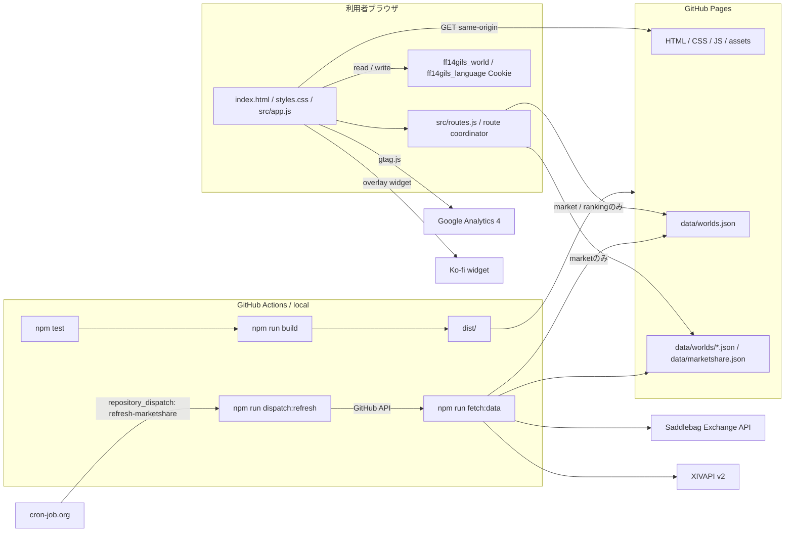

# FF14Gils

FF14 のマーケットデータから、金策候補とワールド別の売上ランキングを確認する GitHub Pages 向け静的サイトです。

## 概要

- 公開URL: `https://jinwktk.github.io/FF14Gils/`
- 初期表示ワールド: `Hades`
- 対応期間: 1日、3日、7日
- 対象ワールド: 公式 Lodestone のワールド構成に合わせた全DC 85ワールド
- 画面: 金策候補 `/`、ワールド売上ランキング `/ranking/`、権利表記とデータ `/legal/`
- UI言語: 日本語 / English。選択言語とワールドは Cookie に保存します。

マーケットデータについては、利用者ブラウザは GitHub Pages から配信される生成済み JSON だけを読みます。ブラウザから Saddlebag Exchange API や XIVAPI v2 へ直接 POST / GET しません。

## 主な機能

- DC とワールドを分けて選択できます。DC は北米、欧州、日本、オセアニアの見出し付きで表示します。
- 期間、検索、状態、最低販売数、列ソートで候補を絞り込めます。
- 金策候補は初期24件を表示し、「さらに表示」で24件ずつ追加します。検索や条件変更時は先頭24件へ戻ります。
- ランキング画面では、生成済みスナップショットの `summary` から期間別の全ワールド売上合計を表示します。
- 最終更新日時は利用者ブラウザのタイムゾーンで表示します。
- 760px以下では条件欄を折りたたみ、金策候補とランキングの表を横スクロール不要のカード表示に切り替えます。HTML上は同じ semantic table を使います。
- `/ranking/` と `/legal/` は GitHub Pages で直接開けるよう、build 時にルート固有の静的入口を生成します。

## 表示と性能の方針

- GA4でモバイル利用が中心であることを確認し、390px前後の画面で結果まで短く到達できる構成を優先します。
- ルートごとの初期データ取得は `/` が `worlds.json` と選択中スナップショット、`/ranking/` が `worlds.json` だけ、`/legal/` はデータ取得なしです。
- 同じリソースの同時取得をまとめ、ルートやワールドを素早く切り替えたときは古い応答を画面へ反映しません。
- UIフレームワーク、依存パッケージ、外部Webフォントは追加せず、first-party HTML/CSS/JS は合計40KiB gzip以下、既定marketデータ込みは64KiB gzip以下をテストで固定します。配信前に生成済みJSONをcompact化し、毎時変動するデータでも予算に余裕を持たせます。
- GA4の自動初回送信は止め、アプリが最終ルートとメタ情報を確定した後に初期表示をメモリ内キューへ登録します。外部計測スクリプトはwindow load後のidle時間に読み込み、読込前の早いSPA遷移だけを最大20件、直前URLとともに補完します。以後はEnhanced Measurementへ任せます。Ko-fi widget も本体描画後に遅延読み込みし、どちらの第三者コードも初期描画を妨げないよう分離します。

## データと権利

FF14Gils は FINAL FANTASY XIV の非公式ファンサイトです。SQUARE ENIX CO., LTD. とは関係ありません。FINAL FANTASY XIV に関する名称、データ、画像、その他の権利は SQUARE ENIX CO., LTD. に帰属します。

データ生成では以下を利用します。

- Saddlebag Exchange API: マーケット集計候補の取得
- XIVAPI v2: アイテム名の補完
- Google Analytics 4: ページ閲覧状況の把握
- Ko-fi: 任意支援ウィジェットの表示

データ元には外部ツールで入手したデータが含まれる場合があります。FF14Gils はその取得方法を管理または保証しません。ゲームクライアント、アカウント、プレイ操作へ接続せず、RMT、BOT、外部ツールによる自動操作を目的としません。

公開ページ上の詳しい説明は `/legal` に置いています。任意支援用の Ko-fi 導線は公式 overlay widget を動的に読み込み、画面右下に小型の1個だけを表示します。

## SEO と計測

- `robots.txt` はクロールを許可し、`https://jinwktk.github.io/FF14Gils/sitemap.xml` を案内します。
- `sitemap.xml` は `/`、`/ranking/`、`/legal/` を登録対象にします。
- 3つの静的入口は、JavaScript実行前から対象画面だけを表示し、それぞれ固有の title、description、canonical、Open Graph、Twitter Card、JSON-LD、見出しを持ちます。SPA のルート URL へ即時転送しません。
- 公開ページの内容を更新した場合は、該当 URL の `lastmod` も同じ変更で更新します。
- Google Search Console の HTML 確認ファイル `googled9f512eea3a99dc1.html` を Pages 配信対象に含めます。
- Google Analytics 4 は Measurement ID `G-VH5GMQMZ34` を `index.html` に置き、ページ閲覧状況の把握だけに使います。`send_page_view:false` で初期化し、アプリが確定した初期URL・title・referrerと、タグ準備前のSPA遷移だけを補完送信します。準備後のHistory API遷移はEnhanced Measurementに任せます。検索入力値は送信しません。

## アーキテクチャ


```mermaid
flowchart LR
  subgraph Browser["利用者ブラウザ"]
    Ui["index.html / styles.css / src/app.js"]
    Routes["src/routes.js / route coordinator"]
    Cookie["ff14gils_world / ff14gils_language Cookie"]
  end

  subgraph Pages["GitHub Pages"]
    Static["HTML / CSS / JS / assets"]
    WorldIndex["data/worlds.json"]
    Snapshots["data/worlds/*.json / data/marketshare.json"]
  end

  subgraph Pipeline["GitHub Actions / local"]
    Tests["npm test"]
    FetchData["npm run fetch:data"]
    Dispatch["npm run dispatch:refresh"]
    Build["npm run build"]
    Dist["dist/"]
  end

  ExternalScheduler["cron-job.org"]

  Saddlebag["Saddlebag Exchange API"]
  Xivapi["XIVAPI v2"]
  Analytics["Google Analytics 4"]
  Kofi["Ko-fi widget"]

  Ui -->|"GET same-origin"| Static
  Ui --> Routes
  Routes -->|"market / rankingのみ"| WorldIndex
  Routes -->|"marketのみ"| Snapshots
  Ui -->|"read / write"| Cookie
  Ui -->|"gtag.js"| Analytics
  Ui -->|"overlay widget"| Kofi

  FetchData --> Saddlebag
  FetchData --> Xivapi
  FetchData --> WorldIndex
  FetchData --> Snapshots
  ExternalScheduler -->|"repository_dispatch: refresh-marketshare"| Dispatch
  Dispatch -->|"GitHub API"| FetchData
  Tests --> Build
  Build --> Dist
  Dist --> Pages
```

`npm run fetch:data` が外部 API からスナップショットを生成し、`npm run build` がJSONのcompact化を含む `dist/` の静的配信物を作ります。push / 手動デプロイでは API を呼ばず、公開中の `data/` を `dist/` に復元した後に再度compact化してから Pages へ反映します。

Saddlebag Exchange API への POST は `Content-Type: application/json` と `Accept: application/json` だけを明示します。独自 `User-Agent` は 401 応答の原因になることがあるため付けません。API が `No items found matching your search parameters.` を返した場合は、そのワールド・期間の売上候補が0件として空データを生成します。

## 開発コマンド

```powershell
npm test
npm run fetch:data
npm run dispatch:refresh
npm run restore:published-data
npm run build
npm run optimize:data
npm run check:performance
npm run serve
```

favicon を再生成する場合:

```powershell
npm run favicon:generate
```

## 環境変数

`npm run fetch:data` の主な設定です。

- `FF14GILS_SERVER`: 既定ワールド
- `FF14GILS_WORLDS`: 生成対象ワールドのカンマ区切り。未指定時は全85ワールド
- `FF14GILS_PERIODS`: `1d`、`3d`、`7d`
- `FF14GILS_PRESET`: `all`、`housing`、`materials`、`consumables`、`collectibles`、`custom`
- `FF14GILS_CUSTOM_FILTERS`: `custom` 用カテゴリ ID
- `FF14GILS_FETCH_RETRIES`: 外部 API の一時的な `429` / `5xx` 応答を再試行する回数
- `FF14GILS_FETCH_RETRY_DELAY_MS`: 外部 API リトライの初回待機時間
- `FF14GILS_ITEM_NAME_LANGUAGE`: XIVAPI v2 から取得するアイテム名の言語。`ja`、`en`、`fr`、`de`

`npm run dispatch:refresh` は外部スケジューラから GitHub Actions の `repository_dispatch: refresh-marketshare` を送るためのローカル確認用コマンドです。定期実行の主経路は cron-job.org から GitHub REST API へ直接 `repository_dispatch` を送る設定です。

- `FF14GILS_GITHUB_TOKEN` または `GITHUB_TOKEN`: GitHub API へ `repository_dispatch` を送るトークン。repo には保存しません。
- `FF14GILS_GITHUB_REPOSITORY`: 送信先。未指定時は `jinwktk/FF14Gils`
- `FF14GILS_DISPATCH_EVENT_TYPE`: イベント名。未指定時は `refresh-marketshare`
- `FF14GILS_DISPATCH_SOURCE`: `client_payload.source`。未指定時は `external-hourly-scheduler`

## デプロイ

`.github/workflows/pages.yml` が GitHub Pages デプロイを担当します。

- trigger: `schedule`、`repository_dispatch: refresh-marketshare`、`push`、`workflow_dispatch`
- 毎回実行: `npm ci`、`npm test`、`npm run build`、`npm run optimize:data`、`npm run check:performance`
- データ更新あり: `schedule` と `repository_dispatch`
- データ更新なし: `push` と `workflow_dispatch`。`npm run restore:published-data` で公開中データを復元
- artifact確定後: JSONをcompact化し、完成した `dist/` が性能予算内か検査してからデプロイ
- 同じ `pages` concurrency group では最新の実行を優先し、新しい実行が未完了の古い実行をキャンセルします。GitHub Actions 障害で実行が待機状態に残っても、次の定期更新が後続を解放します。

毎時データ更新の主経路は、cron-job.org から GitHub REST API の `repository_dispatch: refresh-marketshare` を毎時17分に送る運用です。GitHub Actions の schedule は補助として毎時17分に残しますが、GitHub 側の遅延または間引きがあるため、厳密な毎時起動の主経路にはしません。cron-job.org には `jinwktk/FF14Gils` 限定の Fine-grained PAT を登録し、成功時は GitHub API の HTTP `204` を期待します。

## AIエージェント設定

Matt Pocock Skills のプロジェクト設定を `docs/agents/` に保存しています。

- Issue管理: GitHub Issues（外部PRは自動トリアージ対象外）
- トリアージ: `needs-triage` などの既定5ラベル
- ドメイン文書: 単一コンテキスト構成

詳細は `docs/agents/issue-tracker.md`、`docs/agents/triage-labels.md`、`docs/agents/domain.md` を参照してください。

## Codex MCP設定

Google Search Console と Google Analytics 4 の実測確認には、このプロジェクトだけで有効になるローカル設定 `.codex/config.toml` を使用します。`.codex/` はGitIgnore対象であり、認証ファイル、プロジェクトID、トークンなどの機密情報はGitへ登録しません。

GitHub操作、Web確認、ブラウザー操作、画像生成、設計支援はCodexプラグインまたは標準機能を使用し、同じ用途のMCPを重複登録しません。
